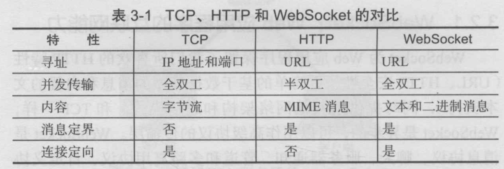

= IM实战-IM In Action 草稿2
bytedesk(c) 2019 jackning
Version 2.0, 2019-06-19
:doctype: book
:icons: font
:source-highlighter: highlightjs
:sectnums:
:toc: left
:toclevels: 4
:toc-title: IM从0到1
:experimental:
:description: 基于Spring Boot/Netty/WebRTC构架即时通讯和在线客服系统
:keywords: 微服务 SpringBoot SpringCloud 虾婆 xiaper.io
:imagesdir: ./img
:sectlinks:

从零开始构建一套基于微服务的即时通讯和在线客服系统
http://www.iminaction.com

== 前言

- 传输方式和传输协议: 前端demo主要以javascript为主,服务器端demo主要以java为主. 
- 实战部分:
前端会包括:web/h5,android,ios,flutter,小程序, 服务端基于spring boot开发,开发语言以java为主

水平有限,难免有错误疏漏之处,敬请指出

== 传输方式 Transport

=== 轮询Http Polling

Ajax
JSONP

=== 捎带轮询Piggyback Polling

=== 长轮询Long Polling

接收消息越频繁,越接近于Http Polling

=== 流Http Streaming

iframe流

=== 反向Ajax

在一个标准的 HTTP Ajax 请求中，数据是从客户端发送给服务器端，反向 Ajax 可以某些特定的方式来模拟发出一个 Ajax 请求, 将数据从服务器端发送到客户端

=== SSE

Server-Send-Event

主要用于服务器向客户端广播或推送消息,而不需要任何交互,如新闻摘要/天气预报等

单向: server to client

参考:

- https://www.ruanyifeng.com/blog/2017/05/server-sent_events.html[Server-Sent Events 教程]

=== SPDY

=== 长连接Long-lived connection

长连接
tcp
全双工双向通信

=== Mars

Mars is a cross-platform network component developed by WeChat.

微信官方开源的跨平台网络组件

=== 方案对比

对上述各种通信方式,以图表的形式对其各自优缺点进行对比

== 传输协议 Protocal

=== WebSocket

而传统的轮询方式（即采用http协议不断发送请求）的缺点：

- 浪费流量（http请求头比较大）、
- 浪费资源（没有更新也要请求）、
- 消耗服务器CPU占用（没有信息也要接收请求）。

可以应用于

- 聊天
- 直播弹幕
- 游戏
- 股票行情
- 协作文档编辑

websocket完全是事件驱动的.也就是说,客户端不需要轮询服务器以得到目标资源的最新状态,只需要监听相关的通知即可.

websocket支持处理文本和二进制数据.

Websocket是消息协议/聊天/服务器通知/管道和多路复用协议/自定义协议/紧凑二进制协议和用于与互联网服务器互操作的其他标准协议的很好基础.

- 持续连接(keep-alive)
- 心跳
- 网络状态检测
- 延迟测量

=== IRC

=== XMPP

smack/XMPPFramework
openfire/ejabberd

=== STOMP

=== MQTT

- websub

原名pubsubhubbub

- pubsub机制

=== 方案对比

对上述各种通信协议,以图表的形式对其各自优缺点进行对比,
得出结论使用websocket

== 框架 Framework

=== CometD

Cometd/Bayeux 协议

https://en.wikipedia.org/wiki/Comet_%28programming%29[wiki]

=== DWR

Direct Web Remoting

DWR supports Comet, Polling and Piggyback (sending data in with normal requests) as ways to publish to browsers.

参考:

- http://directwebremoting.org/dwr/index.html[Direct Web Remoting]

=== Atmosphere

=== Socket.io

=== SockJs

三种传输方式 WebSocket, HTTP Streaming, and HTTP Long Polling

https://spring.io/blog/2012/05/08/spring-mvc-3-2-preview-techniques-for-real-time-updates/[Techniques for Real-time Updates]

== 传输内容 Transport Content

=== Json

=== Protobuf

=== 方案对比

对上述各种通信内容,以图表的形式对其各自优缺点进行对比,得出结论

== 实战

=== 私有协议

=== Netty

=== 建立长连接

(修路)

=== 定义传输协议

(定义交通规则)

=== 消息格式

(步行/自行车/机动车/装甲车)

=== 服务器Server

- webmvc 传统
- webflux 响应式 reactive

==== 一对一

文本
图片

==== 群聊

建群

==== 在线客服

工作组
指定坐席
统计

==== 机器人

- 第三方

=== 安卓Android

==== 一对一

文本
图片

==== 群聊

建群

==== 在线客服

工作组
指定坐席

==== 机器人

- 第三方

=== 苹果iOS

==== 一对一

文本
图片

==== 群聊

建群

==== 在线客服

工作组
指定坐席

==== 机器人

- 第三方

=== 网页Web/H5

==== 一对一

文本
图片

==== 群聊

建群

==== 在线客服

工作组
指定坐席

==== 机器人

- 第三方

=== Windows

- qt
- electron

==== 一对一

文本
图片

==== 群聊

建群

==== 在线客服

工作组
指定坐席

==== 机器人

- 第三方

=== Mac

- qt
- electron

==== 一对一

文本
图片

==== 群聊

建群

==== 在线客服

工作组
指定坐席

==== 机器人

- 第三方

=== 小程序

- 发文本
- 发图片

==== 一对一

文本
图片

==== 群聊

建群

==== 在线客服

工作组
指定坐席

==== 机器人

- 第三方

=== 跨平台Flutter

==== 一对一

文本
图片

==== 群聊

建群

==== 在线客服

工作组
指定坐席

==== 机器人

- 第三方

== 其他

=== 音视频

- webrtc

主要用于实时语音和视频聊天,可以用于传输数据.
可以结合webrtc和websocket构建实时应用

- 基本概念

- 应用

* 文本对话

* 实时音视频

=== 安全篇

- https/ssl

- 数据格式

* 文本传输
* 二进制
* protobuf

=== 加密

* 传输加密
* 存储加密
* 端到端加密

=== 压力测试

=== 对接第三方用户系统

=== 总体架构

=== 高性能

=== 高可用

== 参考

- signal
- telegram
- mars
- mixin

